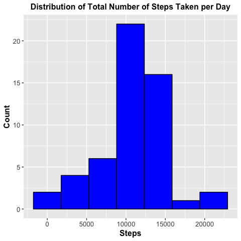
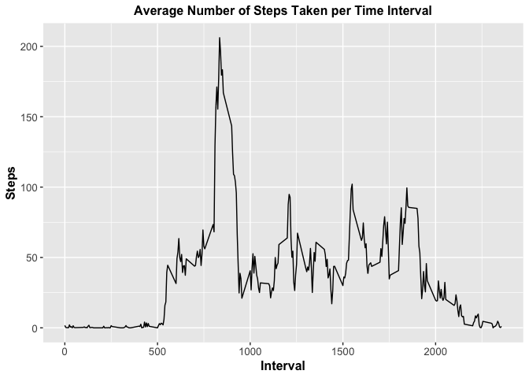
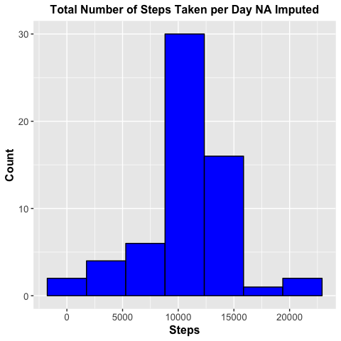
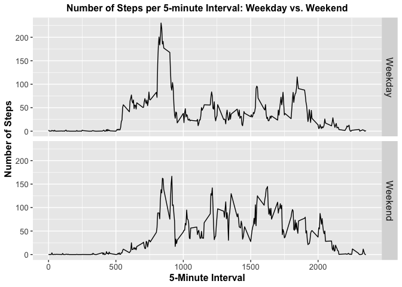

*by mas16*  
Nov 2018

## Introduction
*The following information specifies the software and hardware used to generate the data analysis*

**Language:** R version 3.5.1 (2018-07-02)  
**Editor:** R Studio on Platform x86_64-apple-darwin15.6.0 (64-bit)  
**Operating System:** macOS Mojave Version 10.14.1  
**Computer:** MacBook Air  
**Processor:** 1.3 GHz Intel Core i5  
**Memory:** 4GB 1600 MHz DDR3  

## Loading and Preprocessing the Data

First, check if the data file is located in the working directory. If the data file is not in the working directory, then download it from the course URL.  
**Note:** the data file is downloaded as a zipped file and it must be unzipped. 


```r
## Set variable names for accessing data:
## URL of where the zipped data can be obtained
url <- "https://d396qusza40orc.cloudfront.net/repdata%2Fdata%2Factivity.zip"
## Name of the zipped data 
zipfilename <- "repdata%2Fdata%2Factivity.zip"
## Name of the unzipped data file
unzipfilename <- "activity.csv"

## Case where unzipped data are not in working directory
if (!file.exists(unzipfilename)) {
        
        ## Case where zipped data are not in working directory
        ## Download and unzip
        ## I'm using a Mac, use method = 'curl'
        if (!file.exists(zipfilename)) {
                download.file(url, zipfilename, method='curl')
                unzip(zipfilename)
                
        ## Case where zipped data are in working directory
        ## Unzip
        } else if (file.exists(zipfilename)) {
                unzip(zipfilename)
        } 
}
```

### 1. Load the Data

Now that we have the data file, we need to load the data into R.


```r
## Load the data into variable, activity_data
activity_data <- read.csv("activity.csv")
```

Let's get some information about the data using ```str```:


```r
## Get som information about the data
str(activity_data)
```

```
## 'data.frame':	17568 obs. of  3 variables:
##  $ steps   : int  NA NA NA NA NA NA NA NA NA NA ...
##  $ date    : Factor w/ 61 levels "2012-10-01","2012-10-02",..: 1 1 1 1 1 1 1 1 1 1 ...
##  $ interval: int  0 5 10 15 20 25 30 35 40 45 ...
```

We can see from the output of the ```str``` function that the data consist of **17568** rows and **3** columns. The column names are ```steps```, ```date```, and ```interval```. Importantly, we see that while ```steps``` and ```interval``` are ```int``` objects, ```date``` entries are read in as ```char``` objects so they must be converted. 

To see some details about the data, run the ```summary``` function.


```r
summary(activity_data)
```

```
##      steps                date          interval     
##  Min.   :  0.00   2012-10-01:  288   Min.   :   0.0  
##  1st Qu.:  0.00   2012-10-02:  288   1st Qu.: 588.8  
##  Median :  0.00   2012-10-03:  288   Median :1177.5  
##  Mean   : 37.38   2012-10-04:  288   Mean   :1177.5  
##  3rd Qu.: 12.00   2012-10-05:  288   3rd Qu.:1766.2  
##  Max.   :806.00   2012-10-06:  288   Max.   :2355.0  
##  NA's   :2304     (Other)   :15840
```

From the output of ```summary```, we see some interesting properties of the data. Notably there are **2304** ``NA`` values for ```steps```. Neither ```date``` nor ```interval``` columns are missing any data.

Finally, let's take a look at the actual data by running the ```head``` function.


```r
head(activity_data)
```

```
##   steps       date interval
## 1    NA 2012-10-01        0
## 2    NA 2012-10-01        5
## 3    NA 2012-10-01       10
## 4    NA 2012-10-01       15
## 5    NA 2012-10-01       20
## 6    NA 2012-10-01       25
```

The ouput shows the first 6 rows of the data.

### 2. Transformaing the Data

Recall above that entries in the ```date``` column were read in as ```char```. We should transform these objects to a ```date``` type using the library ```lubridate```. We can see from the output above that the date variables are of the year-month-day (ymd) format.

Let's import ```lubridate```, then convert the ```date``` column.


```r
## Import lubridate
library(lubridate)

## Convert to date
activity_data$date <- ymd(activity_data$date)
```

Ok! Now the data are ready for analysis.

## What is Mean Total Number of Steps Taken per Day?

We will start analyzing the data by determining the mean number of steps taken per day.

### 1. Calculate the Total Number of Steps Taken per Day

We want to calculate the mean total number of steps taken per day. We saw from the output above that the data are organized by date with a measurmement of the number of steps taken at various time intervals throughout the day. Since there are multiple measurements taken per day, we need to sum all the steps for a given day in order to calculate the mean.

Let's do this using the ```aggregate``` function. We have to be careful here because the ```steps``` column contains a lot of ```NA``` values. **Remove** ```NA``` **values by passing the argument,** ```na.action=na.omit```.


```r
## Sum number of steps by day
total_steps <- aggregate(steps ~ date, data=activity_data, FUN=sum, na.action=na.omit)

## Look at the first few sums
head(total_steps)
```

```
##         date steps
## 1 2012-10-02   126
## 2 2012-10-03 11352
## 3 2012-10-04 12116
## 4 2012-10-05 13294
## 5 2012-10-06 15420
## 6 2012-10-07 11015
```

We can see that entries from 2012-10-01 which we saw above as having a lot of ```NA``` values actually consisted entirely of ```NA``` values so it was excluded. It is important to exclude ```NA``` values here so we do not get biased results. ```NA``` values should not be converted to 0 as there is no justification for doing so. For example, steps could have been taken but the measurement could have been corrupted due to error. Therefore it would be inaccurate to set all ```NA``` values to 0.

### 2. Make a Histogram of the Total Number of Steps Taken Each Day

To get an idea of the distribution of steps taken per day, let's make a histogram. 

First, we need to determine the number of bins. Recall, from the lecture that a good number of bins can be determined using **Sturge's Formula**:


```r
## Calculate number of bins using Sturge's Formula
log2(length(total_steps$steps)) + 1
```

```
## [1] 6.72792
```

Let's round this up to 7 bins. Now we can make the plot. I like to use the ```ggplot2``` plotting system. 


```r
## Import ggplot2
library (ggplot2)

## Generate a histogram of total steps taken per day
g <- ggplot(total_steps, aes(steps))
g + geom_histogram(bins=7, color="black", fill="blue") +
        xlab("Steps") + ylab("Count") + 
        ggtitle("Distribution of Total Number of Steps Taken per Day") +
        theme(plot.title = element_text(face="bold", hjust=0.5, size=12)) +
        theme(axis.text = element_text(size=10)) +
        theme(axis.title = element_text(face="bold", size=12))
```

<!-- -->

We can see from the histogram that the distribution of steps is approximately normal.

### 3. Calculate and Report the Mean and Median of the Total Number of Steps Taken per Day

Now let's determine the mean total number of steps taken per day:


```r
## Calculate the mean
mean_total_steps <- mean(total_steps$steps)
mean_total_steps
```

```
## [1] 10766.19
```

And the median total number of steps taken per day:


```r
## Calculate the median
median_total_steps <- median(total_steps$steps)
median_total_steps
```

```
## [1] 10765
```

Based on the above, we see that the mean total number of steps taken per day is **10766.19** and the median number of steps taken per day is **10765**.

## What is the Average Daily Activity Pattern?

To understand the average daily activity pattern, let's make a time series plot that utilizes the ```interval``` data. Here, ```interval``` corresponds to the 5-minute interval. We would like to see how the average number of steps varies as a function of the ```interval```.

### 1. Make a Time Series Plot

In order to generate this plot, we need to first calculate the mean number of steps taken during a given interval across all days. Again, we will use the the ```aggregate``` function and we will omit ```NA``` values to prevent biasing the results.


```r
## Calculate the mean number of steps taken during a given interval where the 
## mean is calculated across all days.
mean_stepint <- aggregate(steps ~ interval, data=activity_data, FUN=mean, na.action = na.omit)

## Look at the first few means
head(mean_stepint)
```

```
##   interval     steps
## 1        0 1.7169811
## 2        5 0.3396226
## 3       10 0.1320755
## 4       15 0.1509434
## 5       20 0.0754717
## 6       25 2.0943396
```

Now, we can generate the plot using ggplot2.


```r
## Plot the time series data
g <- ggplot(mean_stepint, aes(interval,steps), type="l")
g + geom_line() + xlab("Interval") + ylab("Steps") +
        ggtitle("Average Number of Steps Taken per Time Interval") +
        theme(plot.title = element_text(face="bold", hjust=0.5, size=12)) +
        theme(axis.text = element_text(size=10)) +
        theme(axis.title = element_text(face="bold", size=12))
```

<!-- -->

### 2. Which 5-minute Interval, on Average Across All the Days in the Dataset, Contains the Maximum Number of Steps? 

To determine which interval contains the maximum number of steps we can use the ```which``` function.

First calculate the maximum average number of steps taken:


```r
## Get the index of the maximum average number of steps
max_steps <- max(mean_stepint$steps)
max_steps
```

```
## [1] 206.1698
```

Next, use the ```which``` function to determine which interval the maximum number of steps corresponds to:


```r
## Use the which function to determine which interval corresponds to the 
## maximum number of steps
max_stepint <- mean_stepint$interval[which(mean_stepint$steps==max_steps)]
max_stepint
```

```
## [1] 835
```

The 5-minute interval, **835**, contains the maximum number of steps on average across all days in the dataset with **206.1698** steps. 

## Imputing Missing Values

Up until now, we have excluded the ```NA``` values in the analysis to avoid introducing bias. Now let's impute some values to replace the ```NA``` values.

### 1. Calculate and Report the Total Number of Missing Values in the Dataset

The total number of ```NA``` values can be determined by summing up the logical vector returned by the ```is.na``` function. Recall that the vector will have a 1 for every ```NA``` value (TRUE) and a 0 for every value that is not ```NA``` (FALSE).


```r
## Determine number of NAs
sum(is.na(activity_data$steps))
```

```
## [1] 2304
```

There are **2304** ```NA``` values in the data set. This is identical to the original output of ```summary``` which we ran in the beginning of the analysis.

### 2. Devise a Strategy for Filling in All of the Missing Values in the Dataset

One reasonable way to impute the ```NA``` values is to replace them with the corresponding mean number of steps for that 5-minute interval. In order to do this, we have to create an index vector which contains the index of every ```NA``` value. This will be a logical vector.


```r
## Get Rows with NAs in steps
na_index <- is.na(activity_data$steps)
```

The tricky thing is that the intervals reset every day so we cannot simply index the mean steps per interval data we generated before. We need to make a new vector that has the mean steps per interval repeated for each day. This way, the data will be the same size as the ```na_index``` vector above and therefore can be indexed by it.

The number of times the total number of intervals is repeated is given by the number of rows divided by the number of unique intervals. We can calculate the number of repeats as follows:


```r
## Determine number of times the intervals are repeated
repeats = length(activity_data$steps)/length(mean_stepint$interval)
repeats
```

```
## [1] 61
```

Of course, we should first confirm that no intervals were skipped or missing before we impute the data. Let's first generate a vector of the repeated time intervals:


```r
## Vector of time intervals repeated 61 times
test <- rep(mean_stepint$interval, repeats)
```

Now let's compare the ```test``` vector to the intervals extracted from the data:


```r
## Check for missing intervals
identical(activity_data$interval, test)
```

```
## [1] TRUE
```

It's a match! So no intervals were skipped or missing. This makes indexing a lot easier!


```r
## Generate a vector of mean steps per interval repeated 61 times
rep_meanstepint <- rep(mean_stepint$steps, repeats)
```

Let's make a new data frame called ```activity_msi``` (msi for mean step interval) so we don't corrupt the original data. For this new data frame we will have a column containing the mean steps per interval repeated for each day.


```r
## Make a new data frame with an extra column containing the mean step per interval
activity_msi <- cbind(activity_data, rep_meanstepint)
```

Now we can impute the ```NA``` values with the mean number of steps corresponding to their respective time interval using our index vector:


```r
## Imput the NA values using index vector
activity_msi$steps[na_index] <- activity_msi$rep_meanstepint[na_index]
```

### 3. Create a new dataset that is equal to the original dataset but with the missing data filled in.

In order to create a new dataset that is equal to the original dataset but with the missing data filled in, we just have to delete the ```rep_meanstepint``` column from ```activity_msi```. Let's make a new dataset called ```activity_datanew```.


```r
## Make new data set
activity_datanew <- activity_msi[,-4]

## Look at the first few rows of the new dataaset
head(activity_datanew)
```

```
##       steps       date interval
## 1 1.7169811 2012-10-01        0
## 2 0.3396226 2012-10-01        5
## 3 0.1320755 2012-10-01       10
## 4 0.1509434 2012-10-01       15
## 5 0.0754717 2012-10-01       20
## 6 2.0943396 2012-10-01       25
```

We can clearly see the entries that were previously ```NA``` have been replaced with the mean number of steps taken at that interval.

### 4. Make a Histogram of the Total Number of Steps Taken Each Day and Calculate and Report the Mean and Median Total Number of Steps Taken Per Day

We can calculate the total number of steps taken each day in the same way we did before using the ```aggregate``` function.


```r
## Calculate total number of steps taken per day using the imputed data
total_stepsnew <- aggregate(steps ~ date, data=activity_datanew, FUN=sum, na.action=na.pass)
```

Let's make a histogram of the new imputed data. Again, let's use ggplot2.


```r
## Generate a histogram of total steps taken per day
g <- ggplot(total_stepsnew, aes(steps))
g + geom_histogram(bins=7, color="black", fill="blue") +
        xlab("Steps") + ylab("Count") + 
        ggtitle("Total Number of Steps Taken per Day NA Imputed") +
        theme(plot.title = element_text(face="bold", hjust=0.5, size=12)) +
        theme(axis.text = element_text(size=10)) +
        theme(axis.title = element_text(face="bold", size=12))
```

<!-- -->

The histogram looks very similar to the one generated where the ```NA``` values were omitted. The only noticeable difference is the number of counts.

But how different are the data? Let's calculate the mean and median total number of steps for the imputed data and compare it to the original data.


```r
## Calculate the mean
mean_total_stepsnew <- mean(total_stepsnew$steps)
mean_total_stepsnew
```

```
## [1] 10766.19
```

And the median total number of steps taken per day:


```r
## Calculate the median
median_total_stepsnew <- median(total_stepsnew$steps)
median_total_stepsnew
```

```
## [1] 10766.19
```

Based on the above, we see that the mean total number of steps taken per day using imputed data is **10766.19** and the median number of steps taken per day using imputed data is **10766.19**.

We can make a table comparing the imputed and original data using the ```xtable``` package.


```r
## Import xtable package
library(xtable)

## Make a new dataframe
means <- c(mean_total_steps, mean_total_stepsnew)
medians <- c(median_total_steps, median_total_stepsnew)
table_df <- cbind(means,medians)
rownames(table_df) <- c("Original Data", "Data with NA Imputed")
colnames(table_df) <- c("Mean", "Median")
table_df <- as.data.frame(table_df)

## Make a table
xt <- xtable(table_df)
print(xt, type="html")
```

<!-- html table generated in R 3.5.1 by xtable 1.8-3 package -->
<!-- Sat Dec  1 17:49:16 2018 -->
<table border=1>
<tr> <th>  </th> <th> Mean </th> <th> Median </th>  </tr>
  <tr> <td align="right"> Original Data </td> <td align="right"> 10766.19 </td> <td align="right"> 10765.00 </td> </tr>
  <tr> <td align="right"> Data with NA Imputed </td> <td align="right"> 10766.19 </td> <td align="right"> 10766.19 </td> </tr>
   </table>

&nbsp;  

So do these values differ from the estimates from the first part of the assignment?  
*Not Really.* The values are nearly identical.

And what is the impact of imputing missing data on the estimates of the total daily number of steps?  
The shape of the distribution and mean and median values do not change very much. However, the counts for some bins do increase modestly when data is imputed as expected.

## Are There Differences in Activity Patterns between Weekdays and Weekends?

To see if there is a difference in activity patterns between weekdays and weekends, we need to be able to distinguish data collected on weekdays and weekends. We can do this using factors. We will stick with the imputed data here.

### 1. Create a New Factor Variable in the Dataset with Two Levels – “Weekday” and “Weekend”

First, let's convert the dates to days of the week using the ```weekdays``` function. 


```r
## Make a new data frame to avoid corrupting the original 
activity_dataday <- activity_datanew

## Convert the dates to days of the week
activity_dataday$date <- weekdays(activity_dataday$date)

## Take a look at the first few rows
head(activity_dataday)
```

```
##       steps   date interval
## 1 1.7169811 Monday        0
## 2 0.3396226 Monday        5
## 3 0.1320755 Monday       10
## 4 0.1509434 Monday       15
## 5 0.0754717 Monday       20
## 6 2.0943396 Monday       25
```

As the ouput above shows, the dates have now been converted to days of the week. Next, let's index the weekdays and weekends:


```r
## Index the weekdays
days <- !(activity_dataday$date == "Saturday" | activity_dataday$date == "Sunday")

## Index the weekends
ends <- (activity_dataday$date == "Saturday" | activity_dataday$date == "Sunday")
```

Now let's make a new variable called ```day_class``` to denote weekday or weekend.


```r
activity_dataday$day_class[days] <- "Weekday"

activity_dataday$day_class[ends] <- "Weekend"
```

Finally, let's convert ```day_class``` to a factor variable.


```r
## Convert to factor
activity_dataday$day_class <- as.factor(activity_dataday$day_class)
```

### 2. Make a Panel Plot Containing a Time Series Plot of the 5-Minute Interval and the Average Number of Steps Taken, Averaged Across All Weekday Days or Weekend Days

To make this plot, we need to average the number of steps taken across all days like we did before using the ```aggregate``` function.


```r
## Calculate mean number of steps taken averaged across all weekday days or weekend days
mean_stepintday <- aggregate(steps ~ interval + day_class, data=activity_dataday, FUN=mean, na.action = na.pass)

## Take a look at the first few rows
head(mean_stepintday)
```

```
##   interval day_class      steps
## 1        0   Weekday 2.25115304
## 2        5   Weekday 0.44528302
## 3       10   Weekday 0.17316562
## 4       15   Weekday 0.19790356
## 5       20   Weekday 0.09895178
## 6       25   Weekday 1.59035639
```

The output above looks good. Now let's make the plot using ggplot2.


```r
g <- ggplot(mean_stepintday, aes(interval, steps), type="l")
g + facet_grid(day_class ~ .) + geom_line() +
        xlab("5-Minute Interval") +
        ylab("Number of Steps") +
        ggtitle("Number of Steps per 5-minute Interval: Weekday vs. Weekend") +
        theme(plot.title = element_text(face="bold", hjust=0.5, size=12)) +
        theme(axis.text = element_text(size=10))+
        theme(axis.title = element_text(face="bold", size=12))+
        theme(strip.text.y = element_text(size = 12))
```

<!-- -->

We can see from the plot that there tends to be more steps taken in the earlier time intervals during the weekdays. There also appears to be a slight increase in the number of steps taken during the middle intervals during weekends.

